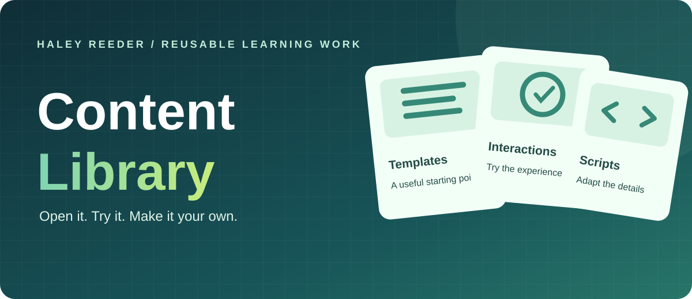
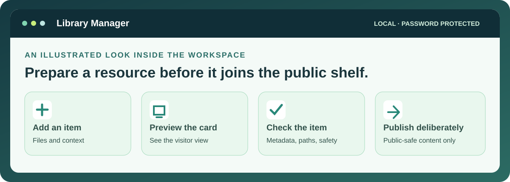

# Content Library

**Reusable learning ideas you can open, try, and adapt.** The Content Library collects instructional-design examples, templates, code, and practical resources in one browsable place.

**[Browse the Content Library →](https://reeder-design.github.io/id-content-library/)** &nbsp;·&nbsp; **[Visit Haley's portfolio →](https://reeder-design.github.io/id-portfolio-system/)**

## How to explore

1. Browse by the type of resource you need.
2. Open an item to see its context, preview, and available files or links.
3. Use the item guidance to adapt the idea to your own learning problem.

## Public library · private manager

**Public:** The [Content Library](https://reeder-design.github.io/id-content-library/) is a browser-based catalog of approved items.

**Local and password-protected:** Library Manager prepares, previews, validates, and publishes items. It runs on my computer and is not accessible from the public library.

[See the managers in the portfolio guide →](https://reeder-design.github.io/id-portfolio-system/projects/github-workflow/) · [Read the Library Manager guide →](library-manager/README.md) · [Repository details →](docs/repository-guide.md)

Only public-safe material belongs in this repository.
